# 基于NRF7002 开发板实现的BLE  蓝牙键鼠符合设备试验

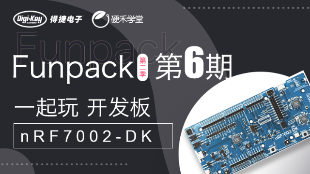

# 任务内容

完成使用板卡的蓝牙连接，设计一个蓝牙鼠标+键盘复合设备，按键1作为鼠标点击，按键2作为键盘输入按下时输入“eetree”字符，电脑开启大写锁定时，板卡的LED亮起。

在规定时间内完成上述试验，提交相关程序、文档和演示视频，即可白嫖开发板。


## 活动链接

[Digikey Funpack (eetree.cn)](https://www.eetree.cn/page/digikey-funpack/rule18)


# 板卡介绍

[nRF7002-DK](https://www.nordicsemi.com/Products/Development-hardware/nRF7002-DK?lang=zh-CN)是用于`nRF7002` `Wi-Fi 6`协同IC的开发套件，该开发套件采用`nRF5340`多协议片上系统 (SoC) 作为`nRF7002`的主处理器，在单一的电路板上包含了开发工作所需的一切，可让开发人员轻松开启基于nRF7002 的物联网项目。该 DK 包括` Arduino `连接器、两个可编程按钮、一个 Wi-Fi 双频段天线和一个低功耗蓝牙天线，以及电流测量引脚。

通过下述的硬件框图可以知道`nRF7002`芯片仅作为一颗从芯片使用，其通过QSPI总线和nRF5340协同工作。板卡上内置了一颗nRF5340模拟的JTAG控制器，不需要再外接其他调试器。

nRF7002芯片拥有双频wifi工作能力，支持2.4GHz和5GHz两个工作频段，符合（IEEE802.11ax 规范）。硬件上兼容Matter协议，wifi6也为连接提供了更加安全的保障。

除了wifi能力外，依托于nRF5340芯片，板卡还提供了低功耗蓝牙BLE、BLE-Mesh、Thread以及Zigbee的能力。BLE能力从硬件上支持全向测距AoA和AoD功能，同时还支持还支持NFC、ANT、802.15.4和2.4 GHz专有协议。

NFC功能在实际产品中可以用做碰一碰配网和近距离认证相关应用。

## 板卡图片

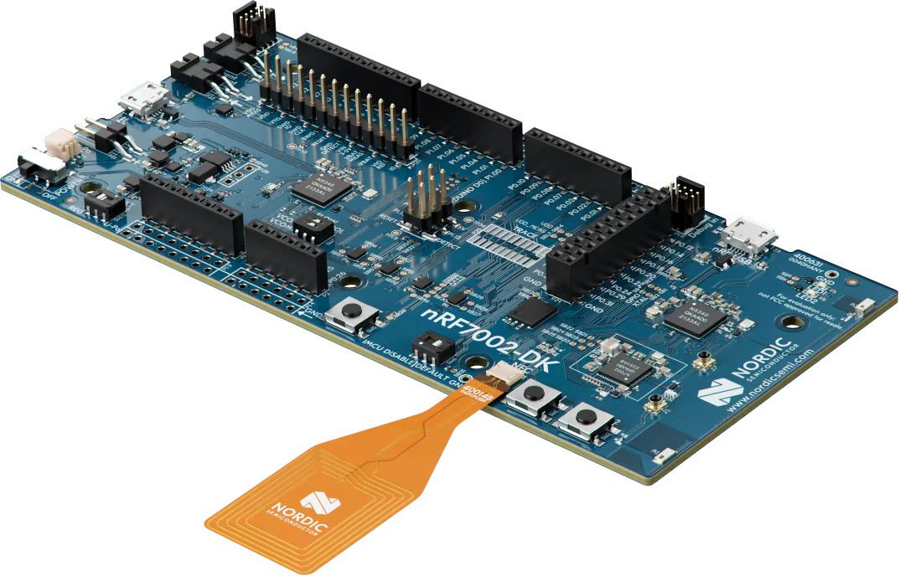

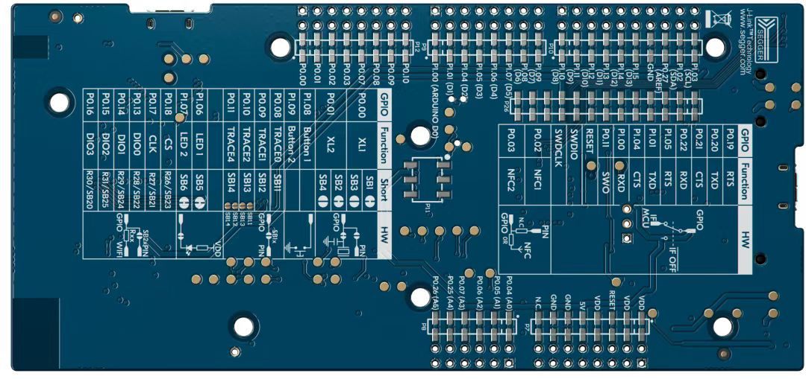

## 板卡电路框图

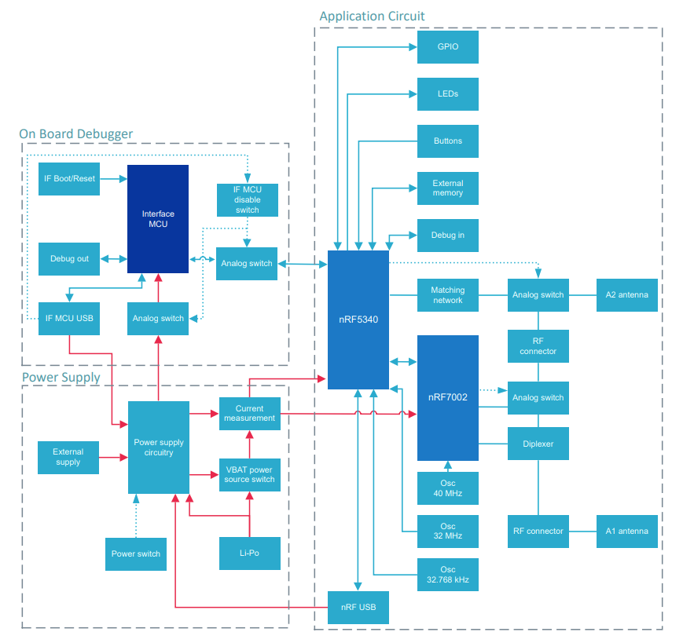


# 功能需求分析

## 功能关键词

在实现相关功能之前我们需要对一下关键词 和 技术有一定的了解：

- BLE
  - GAP和GATT
  - Service、characteristic、UUID、profile
  - HID

- USB
  - HID
  - Report

## 资料推荐

- BLE：[BLE低功耗蓝牙技术详解 (iotxx.com)](http://doc.iotxx.com/index.php?title=ble%BC%BC%CA%F5%BD%D2%C3%D8&oldid=1973)
- USB HID：[HID 描述符(通用) - USB中文网 (usbzh.com)](https://www.usbzh.com/article/detail-5.html)


## 实现框图

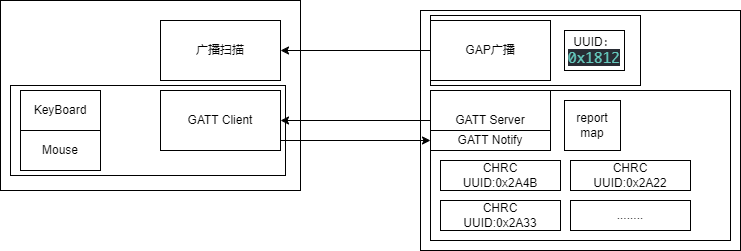


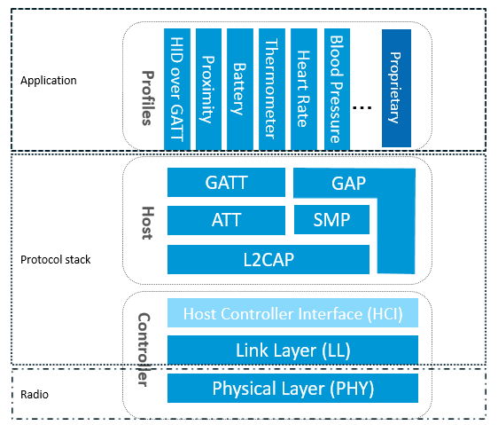

## 原理描述

在具备一定蓝牙和USB HID常识之后配合`实现框图`，可以大题上对整个项目的实现有一定的了解，整个过程可以分为两个阶段：

1. BLE在广播阶段携带HID（人体工程学设备）的UUID---0x1812,并进行周期性广播。PC端定时监听空中的低功耗BLE广播数据，当检测到广播中存在HID信息，便会在蓝牙设备搜索列表中显示当前广播的名字，并且通过HID的UUID来区分人体工程学设备是鼠标、键盘or JoyPad。

2. 当用户在PC的蓝牙设备搜索列表中单击连接了当前设备，就会发起连接请求。设备端相应连接请求并且发起认证流程，通过PIN配对码和PC端完成配对之后即可建立连接。

   建立连接后PC端可以直接通过查询接口读取和修改设备端的char内的数据，也可以发起订阅通知，这样就可以主动的将数据发给PC端。

   BLE的蓝牙HID沿用了部分USB HID的技术方案，通过上图可以看到HID是内嵌在GATT层的。因此在通讯的始亦，会将HID的report_map发送给PC，PC会根据设备端传来的map确定设备类型以及后续数据传输的格式。

   后续HID数据的传输，不管是键盘还是鼠标都按照map表定义的数据结构通过调用低功耗蓝牙的发送接口从设备端发送给PC。


# 功能实现

## 环境搭建&工程创建

1. nRF7002 的开发环境依托于Vscode，所以首先需要安装Vscode，相关教程网上一大堆这里就不赘述。（下载连接：[Visual Studio Code - Code Editing. Redefined](https://code.visualstudio.com/)）

2. 安装工具链和包部署工具

   nRF Command Line Tools（[nRF Command Line Tools - Downloads - nordicsemi.com](https://www.nordicsemi.com/Products/Development-tools/nRF-Command-Line-Tools/Download)）

   nRF Connect for Desktop（[nRF Connect for Desktop - nordicsemi.com](https://www.nordicsemi.com/Products/Development-tools/nRF-Connect-for-desktop)）

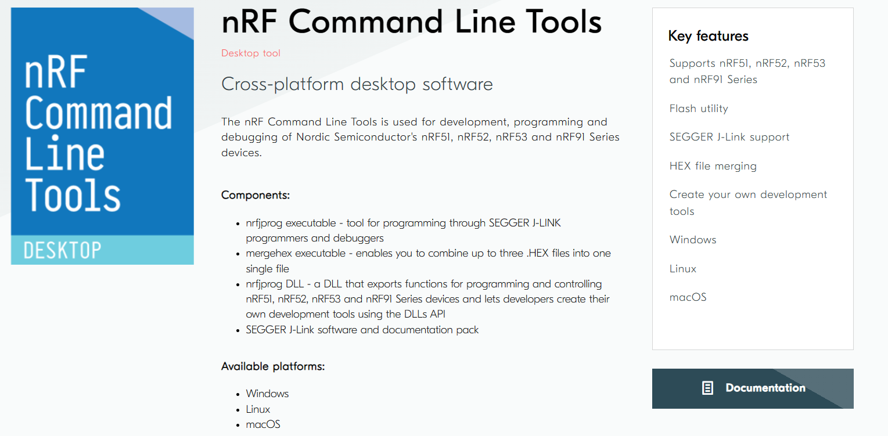

选择电脑相应的平台进行下载安装即可。

3. 通过`nRF Connect for Desktop`工具快速安装工具链和SDK包

打开`nRF Connect for Desktop`APP，选择`Toolchain Manager`项进行安装。安装完成之后点击open进行打开。

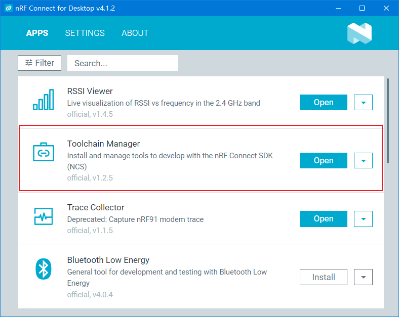


4. 在`Toolchain Manager`中选择一个SDK包进行安装，这里我们选择最新的v2.4.2（这里安装的时候可能会出现各种作物，本质上都是网络的问题尝试使用魔法即可解决问题）

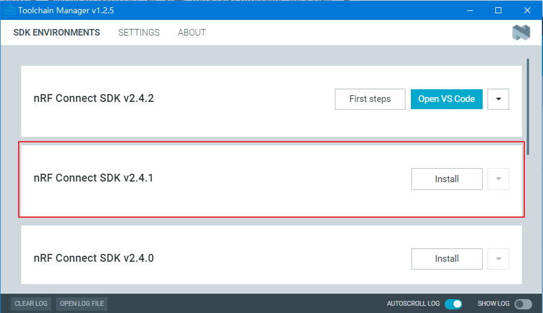

3. 安装完成之后会有如下弹窗，直接点击安装即可：

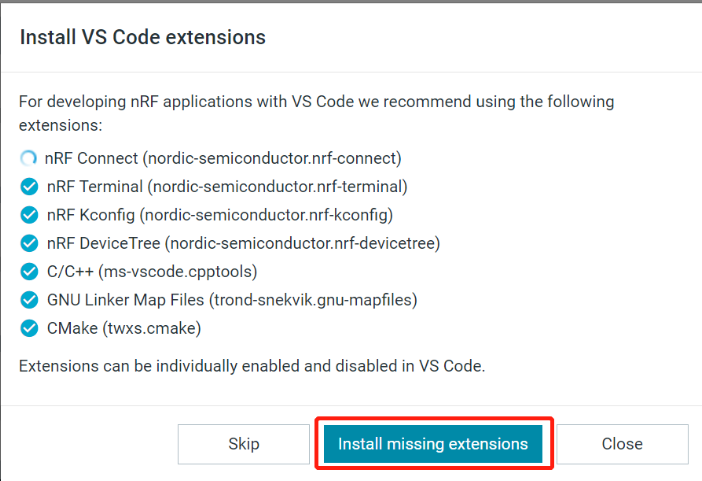

5. 打开vscode，点击拓展安装`nRF Connect for VS Code Extension Pack`工具。此工具会安装vscode 中所有的依赖项。

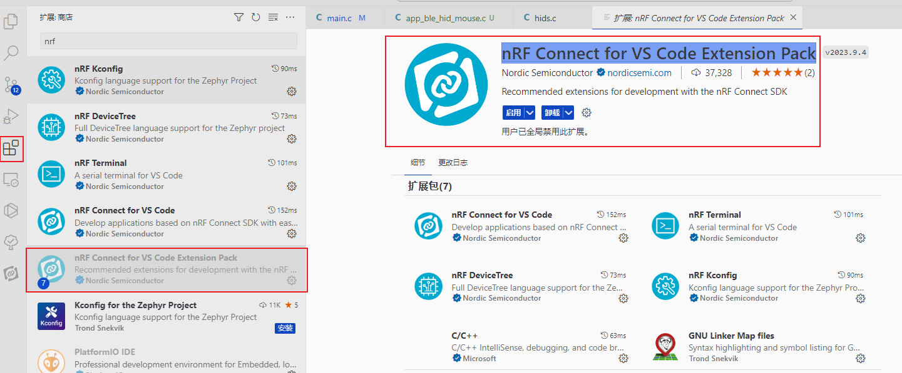

6. 安装完成后点击菜单栏的小图标，然后就可以选择SDK和Toolchain的位置

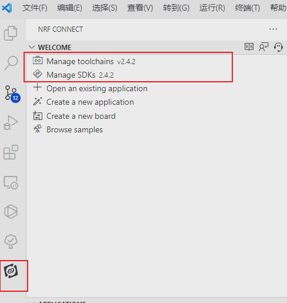

7. 接下来我们导入一个新的工程，来验证SDK配置已经无误。这里我们导入了一个HID Mouse的例程，当然后续所有的代码我们也是在此基础上修改来的。

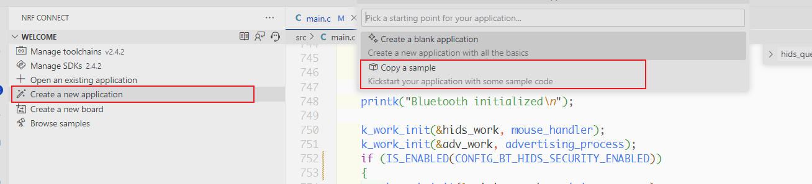

点击`Build`编译按钮，等待程序编译完成。

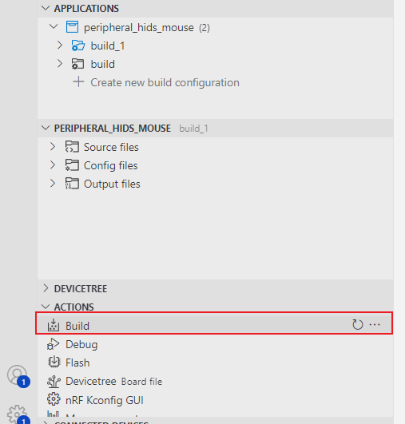

程序编译完成后如果输出如下类似打印说明程序编译成功，接下来就可以开始我们的代码编写了。

```shell
[282/284] Linking C executable zephyr\zephyr.elf
Memory region         Used Size  Region Size  %age Used
           FLASH:      141348 B      1008 KB     13.69%
             RAM:       31344 B       448 KB      6.83%
        IDT_LIST:          0 GB         2 KB      0.00%
[283/284] Generating zephyr/merged.hex
[284/284] Generating zephyr/merged_domains.hex
```


## ble 广播功能

广播功能我们直接沿用HID Mouse例程中的代码，但是为了让我们的代码看起来更加的专业这里我们修改下广播中的UUID（从`0x03C2`修改为`0x03C0`），这样在设备列表中会显示成一个键盘和鼠标的图标，而不是一个单一的鼠标图标。


相关代码如下：

```c
//////////C:\ncs\v2.4.2\zephyr\include\zephyr\bluetooth\gap.h
#define BT_APPEARANCE_GENERIC_HID                      0x03C0 /* Generic Human Interface Device */
#define BT_APPEARANCE_HID_KEYBOARD                     0x03C1 /* Keyboard */
#define BT_APPEARANCE_HID_MOUSE                        0x03C2 /* Mouse */
#define BT_APPEARANCE_HID_JOYSTICK                     0x03C3 /* Joystick */
#define BT_APPEARANCE_HID_GAMEPAD                      0x03C4 /* Gamepad */

//////////main.c
/*广播数据*/
static const struct bt_data ad[] = {
	BT_DATA_BYTES(BT_DATA_GAP_APPEARANCE,
				  (BT_APPEARANCE_GENERIC_HID >> 0) & 0xff,
				  (BT_APPEARANCE_GENERIC_HID >> 8) & 0xff),
	// 	      (BT_APPEARANCE_HID_KEYBOARD >> 0) & 0xff,
	// 	      (BT_APPEARANCE_HID_KEYBOARD >> 8) & 0xff),

	BT_DATA_BYTES(BT_DATA_FLAGS, (BT_LE_AD_GENERAL | BT_LE_AD_NO_BREDR)),
	BT_DATA_BYTES(BT_DATA_UUID16_ALL, BT_UUID_16_ENCODE(BT_UUID_HIDS_VAL),
				  BT_UUID_16_ENCODE(BT_UUID_BAS_VAL)),
};
```


## ble数据发送功能

ble的数据发送接口其实在zephyr的SDK中已经封装的很完善了我们只需要直接调用发送和Notify即可。

```c
struct bt_gatt_notify_params params = {0};

params.attr = &hids_obj->gp.svc.attrs[hids_inp_rep->att_ind];
params.data = rep;
params.len = hids_inp_rep->size;
params.func = cb;

int err = bt_gatt_notify_cb(conn, &params);

```


## HID map表定义

map表是设备的灵魂，我们参考原有的表进行修改即可。

```c
static const uint8_t report_map[] = {		
    0x05, 0x01,     /* Usage Page (Generic Desktop) */
    0x09, 0x02,     /* Usage (Mouse) */

    0xA1, 0x01,     /* Collection (Application) */

    /* Report ID 1: Mouse buttons + scroll/pan */
    0x85, 0x01,       /* Report Id 1 */
    0x09, 0x01,       /* Usage (Pointer) */		
    0xA1, 0x00,       /* Collection (Physical) */
    0x05, 0x09,       /* Usage Page (Buttons) */
    0x19, 0x01,       //     USAGE_MINIMUM (Button 1)
    0x29, 0x03,       //     USAGE_MAXIMUM (Button 3)
    0x15, 0x00,       /* Logical Minimum (0) */
    0x25, 0x01,       /* Logical Maximum (1) */		
    0x95, 0x03,       /* Report Count (3) */
    0x75, 0x01,       /* Report Size (1) */
    0x81, 0x02,       /* Input (Data, Variable, Absolute) */

    0x95, 0x01,       /* Report Count (1) */
    0x75, 13,         /* Report Size (13) */
    0x81, 0x01,       /* Input (Constant) for padding */
    
    0x95, 0x01,       /* Report Count (1) */
    0x75, 0x08,       /* Report Size (8) */
    0x05, 0x01,       /* Usage Page (Generic Desktop) */
    0x09, 0x38,       /* Usage (Wheel) */
    0x15, 0x81,       /* Logical Minimum (-127) */
    0x25, 0x7F,       /* Logical Maximum (127) */
    0x81, 0x06,       /* Input (Data, Variable, Relative) */
    0xC0,             /* End Collection (Physical) */

    /* Report ID 2: Mouse motion */
    0x85, 0x02,       /* Report Id 2 */
    0x09, 0x01,       /* Usage (Pointer) */
    0xA1, 0x00,       /* Collection (Physical) */
    0x75, 0x0C,       /* Report Size (12) */
    0x95, 0x02,       /* Report Count (2) */
    0x05, 0x01,       /* Usage Page (Generic Desktop) */
    0x09, 0x30,       /* Usage (X) */
    0x09, 0x31,       /* Usage (Y) */
    0x16, 0x01, 0xF8, /* Logical maximum (2047) */
    0x26, 0xFF, 0x07, /* Logical minimum (-2047) */
    0x81, 0x06,       /* Input (Data, Variable, Relative) */
    0xC0,             /* End Collection (Physical) */
    0xC0,              /* End Collection */

/**keyboard*/
    0x05, 0x01,       /* Usage Page (Generic Desktop) */
    0x09, 0x06,       /* Usage (Keyboard) */
    0xA1, 0x01,       /* Collection (Application) */
    0x85, 0x03,			/* Report Id (3) */

    0x05, 0x07,       /* Usage Page (Key Codes) */
    0x19, 0xe0,       /* Usage Minimum (224) */
    0x29, 0xe7,       /* Usage Maximum (231) */
    0x15, 0x00,       /* Logical Minimum (0) */
    0x25, 0x01,       /* Logical Maximum (1) */
    0x75, 0x01,       /* Report Size (1) */
    0x95, 0x08,       /* Report Count (8) */
    0x81, 0x02,       /* Input (Data, Variable, Absolute) */

    0x95, 0x01,       /* Report Count (1) */
    0x75, 0x08,       /* Report Size (8) */
    0x81, 0x01,       /* Input (Constant) reserved byte(1) */

    0x95, 0x06,       /* Report Count (6) */
    0x75, 0x08,       /* Report Size (8) */
    0x15, 0x00,       /* Logical Minimum (0) */
    0x25, 0x65,       /* Logical Maximum (101) */
    0x05, 0x07,       /* Usage Page (Key codes) */
    0x19, 0x00,       /* Usage Minimum (0) */
    0x29, 0x65,       /* Usage Maximum (101) */
    0x81, 0x00,       /* Input (Data, Array) Key array(6 bytes) */   

    /* LED */
    0x85, 0x03,                     /* Report Id (3) */
    0x95, 0x05,                                          /* Report Count (5) */
    0x75, 0x01,                                          /* Report Size (1) */
    0x05, 0x08,                                          /* Usage Page (Page# for LEDs) */
    0x19, 0x01,                                          /* Usage Minimum (1) */
    0x29, 0x05,                                          /* Usage Maximum (5) */
    0x91, 0x02, /* Output (Data, Variable, Absolute), */ /* Led report */
    0x95, 0x01,                                          /* Report Count (1) */
    0x75, 0x03,                                          /* Report Size (3) */
    0x91, 0x01, /* Output (Data, Variable, Absolute), */ /* Led report padding */
    0xC0,                                                /* End Collection (Application) */
};
```


## HID keyboard 实现

```c
static int key_report_con_send(const struct keyboard_state *state,
							   bool boot_mode,
							   struct bt_conn *conn)
{
	int err = 0;
	uint8_t data[INPUT_REPORT_KEYS_MAX_LEN];
	uint8_t *key_data;
	const uint8_t *key_state;
	size_t n;

	data[0] = state->ctrl_keys_state;
	data[1] = 0;
	key_data = &data[2];
	key_state = state->keys_state;

	for (n = 0; n < KEY_PRESS_MAX; ++n)
	{
		*key_data++ = *key_state++;
	}
	if (boot_mode)
	{
		err = bt_hids_boot_kb_inp_rep_send(get_hid_obj(), conn, data,
										   sizeof(data), NULL);
	}
	else
	{
		err = bt_hids_inp_rep_send(get_hid_obj(), conn,
								   2, data, // 这里的0 对应report_map 中的 Report Id INPUT_REP_KEYS_IDX
								   sizeof(data), NULL);
	}
	return err;
}

```


| Byte 1                       | Byte 2 | Byte 3-8   |
| ---------------------------- | ------ | ---------- |
| 特殊按键（Ctrl Shift Alt等） | 未知   | 普通按键值 |


## HID Mouse 实现

| Byte 1       | Byte 2    | Byte 3    |
| ------------ | --------- | --------- |
| 鼠标按钮数据 | X轴偏移量 | Y轴偏移量 |

```c
    uint8_t x_buff[2];
    uint8_t y_buff[2];
    uint8_t buffer[INPUT_REP_MOVEMENT_LEN];

    int16_t x = MAX(MIN(x_delta, 0x07ff), -0x07ff);
    int16_t y = MAX(MIN(y_delta, 0x07ff), -0x07ff);

    /* Convert to little-endian. */
    sys_put_le16(x, x_buff);
    sys_put_le16(y, y_buff);

    /* Encode report. */
    BUILD_ASSERT(sizeof(buffer) == 3,
                 "Only 2 axis, 12-bit each, are supported");

    buffer[0] = (check&0x01);
    buffer[1] = 0;
    buffer[2] = 0;

    bt_hids_inp_rep_send(get_hid_obj(), conn_mode[i].conn,
                         // INPUT_REP_MOVEMENT_INDEX,
                         INPUT_REP_BUTTONS_INDEX, // 这里的0 对应report_map 中的 Report Id 1
                         buffer, sizeof(buffer), NULL);
```


## 设备树IO配置

zephyr系统继承了Linux的优点使用了强大的设备树功能，设备树编写的门槛还是有一点高的，因此nrf 编写了一套可视化的设备树生成工具，直接在GUI中点一点即可配置相关GPIO和外设。

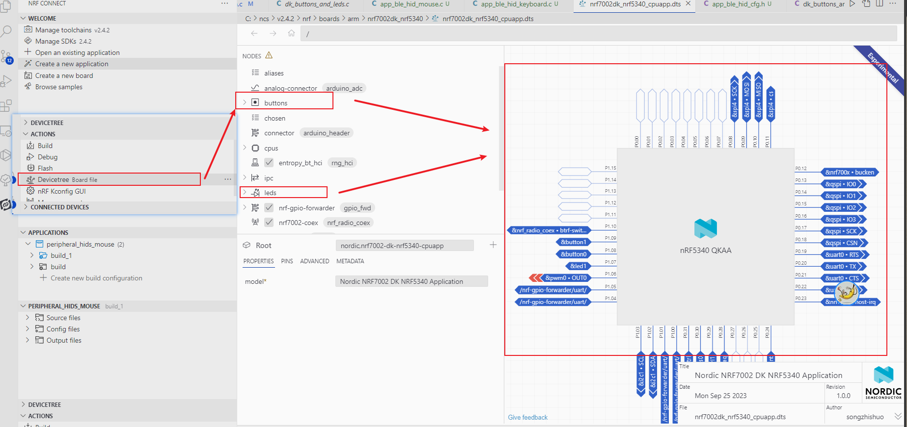


# 资料参考

- BLE：[BLE低功耗蓝牙技术详解 (iotxx.com)](http://doc.iotxx.com/index.php?title=ble%BC%BC%CA%F5%BD%D2%C3%D8&oldid=1973)
- USB HID：[HID 描述符(通用) - USB中文网 (usbzh.com)](https://www.usbzh.com/article/detail-5.html)
- [Zephyr API Documentation: Introduction (zephyrproject.org)](https://docs.zephyrproject.org/apidoc/latest/index.html)
- [Zephyr-设备树原理和使用_设备树reg属性_只想.静静的博客-CSDN博客](https://blog.csdn.net/u011638175/article/details/121401579)
- [USB协议中HID设备描述符以及键盘按键值对应编码表_usb键盘编码表_arenascat的博客-CSDN博客](https://blog.csdn.net/u012388993/article/details/116395497)

